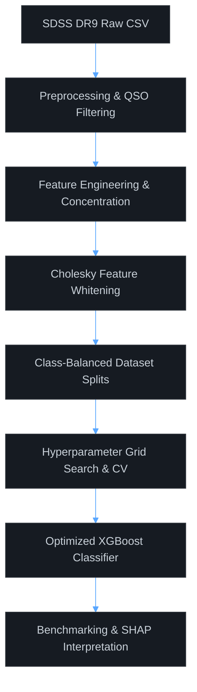

# Photometric Star-Galaxy Classification Using Optimized Gradient Boosted Decision Trees

## Abstract
This project implements a high-performance machine learning pipeline for binary star-galaxy classification using photometric data from the Sloan Digital Sky Survey (SDSS) Data Release 9 (DR9). Drawing methodological inspiration from Sevilla-Noarbe & Etayo-Sotos (2015), we leverage extreme Gradient Boosting (XGBoost) and a custom Cholesky-based whitening transform (Feature Decorrelation) to classify astronomical sources. The primary objective is to replicate the paper's matched-efficiency benchmark, demonstrating a substantial reduction in stellar contamination (impurity) across various magnitude regimes compared to standard SDSS photometric pipeline cuts. The model's decision boundaries and feature relationships are further interpreted using SHapley Additive exPlanations (SHAP) to ensure astronomical consistency.

---

## Methodology
The overall classification pipeline follows a rigorous academic methodology designed to handle high-dimensional, correlated photometric parameters:

### 1. Feature Whitening (Decorrelation)
To handle highly correlated multi-band magnitudes, we implement a linear whitening transform using the Cholesky decomposition of the covariance matrix of the training set features. For a feature matrix $X$, the transformed features $X'$ are obtained via:
$$X' = (X - \mu) L^{-T}$$
where $L$ is the lower-triangular Cholesky factor of the covariance matrix $\Sigma = L L^T$, and $\mu$ is the vector of feature means. This aligns with the Boosted Decision Trees with Decorrelation (BDTD) technique.

### 2. Gradient Boosting (XGBoost)
The classification backend utilizes XGBoost, optimized to minimize binary log-loss via parallel coordinate grid search. Early stopping is applied using an independent evaluation subset to prevent overfitting.

### 3. Model Interpretation
Model transparency and feature contributions are explained locally and globally using TreeSHAP, isolating how morphological parameters like concentration drive classification decisions in bright versus faint magnitude regimes.

---

## Dataset & Preprocessing
The model is trained on a spectroscopic sample extracted from the **SDSS DR9 database** containing $2,195,173$ objects matching the CasJobs query constraints.

### Preprocessing Steps
1. **Target Filtering**: Quasi-stellar objects (QSOs) are excluded to restrict the classification task to a binary problem (Galaxies vs. Stars).
2. **Sentinel Handling**: Missing value placeholders (sentinels like `-9999` and `9999`) are replaced with `NaN` and rows containing missing values are removed ($<0.05\%$ of data).
3. **Derived Features**:
   - **Colors**: Color indices representing flux differences between adjacent bands: $(u-g)$, $(g-r)$, $(r-i)$, and $(i-z)$.
   - **Concentration**: Computed as the difference between PSF and model magnitudes in the r-band:
     $$\text{concentration} = \text{psfmag\\_r} - \text{modelmag\\_r}$$
4. **Data Splitting**:
   - **Training Pool**: $200,000$ objects (subsampled to class-balanced default sizes: $30,000$ galaxies and $6,000$ stars).
   - **Evaluation Set**: $800,000$ objects for hyperparameter search validation and early stopping.
   - **Test Set**: $965,187$ held-out objects for final blind benchmarking.

---

## Results & Discussion
The pipeline achieves a significant improvement over the legacy SDSS photometric classification baseline (based on the `type` flag). Under the matched-efficiency protocol, we calibrate our decision thresholds per magnitude bin to match standard SDSS galaxy selection rates.

### Core Metrics Summary
* **Stellar Impurity Reduction**: The optimized XGBoost model achieves an overall **1.60× mean reduction** in star contamination (impurity) over the legacy SDSS photometric baseline, peaking at **2.26×** (at magnitude $r = 15.5$) and **2.21×** (at $r = 16.5$). The benefit of feature decorrelation is quantified by a **0.256% absolute reduction** in mean test impurity (from 5.229% to 4.973%).
* **Model Explainability**: SHAP analysis confirms that the derived `concentration` parameter remains the primary discriminator for stellar vs. resolved sources, showing high SHAP importance for point-like objects (stars) which decay sharply in significance at fainter magnitudes due to noise.

### Figures & Artifacts
The output plots and evaluations are structured and saved under the `figures/` directory.
